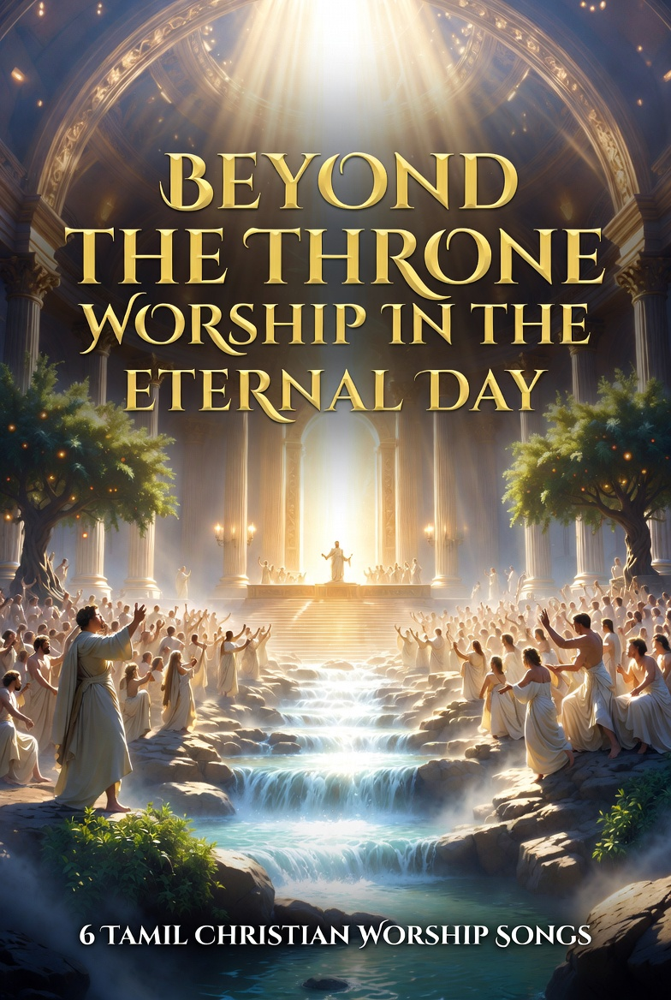

# Album 7: Beyond the Throne – Worship in the Eternal Day  
சிங்காசனத்திற்கு அப்பால் – நித்திய நாளில் ஆராதனை

6 freshly anointed Tamil Christian worship songs with English translations.

This album is pure throne-centered worship — beyond time, beyond the tribulation, beyond the millennium — in the eternal day where God and the Lamb are the temple, the light, the river, and the life (Revelation 21–22).

Music generated with AI tools.  
Lyrics original, written under divine inspiration.  
All glory to the Lord Jesus Christ.

These songs are offered freely as worship to Jesus Christ and encouragement to the remnant.

இந்த பாடல்கள் இயேசு கிறிஸ்துவுக்கு ஆராதனையாகவும், எஞ்சியோருக்கு ஊக்கமாகவும் இலவசமாக வழங்கப்படுகின்றன.

## Songs
1. **[பரிசுத்த பர்வதமான எனது கர்த்தாவே – O Holy Mountain, My Lord](./Song01_O_Holy_Mountain_My_Lord/)**  
2. **[நீதியின் தேவனே – God of Righteousness](./Song02_God_of_Righteousness/)**  
3. **[என் அழுகையின் சத்தம் கேட்ப்பார் – He Hears My Cry](./Song03_He_Hears_My_Cry/)**  
4. **[செம்மையான இருதயத்தை தாருமே – Grant Me a Pure Heart](./Song04_Grant_Me_A_Pure_Heart/)**  
5. **[இரவும் பகலும் வேதத்தை தியானிக்கும் மனிதன் பாக்கியவான் – Blessed Is the One Who Meditates Day and Night](./Song05_Blessed_Is_the_One_Who_Meditates/)**  
6. **[வானத்திற்கு மேலாக உமது மகத்துவம் – Your Majesty Above the Heavens](./Song06_Your_Majesty_Above_The_Heavens/)**

## Full Lyrics Book
- [Download Album 7 Full Lyrics Book (Tamil & English)](./Album7_BeyondTheThrone_FullLyricsBook_TamilEnglish.pdf)

## Cover

---

**Author**: Remnant, Tamil Intercessor  
**All glory to the Lord Jesus Christ — worship beyond the throne forever!**
